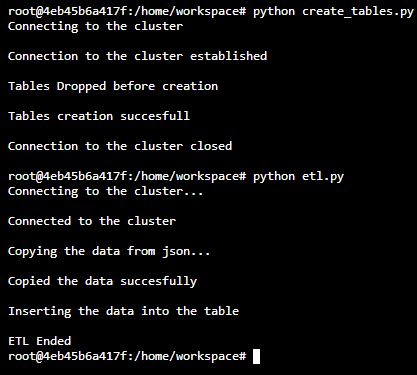

# Data Warehouse for Sparkify

## Contents
* [Description](#Description)
* [Schema](#Schema)
* [Files](#Files)
* [How to run](#How-to-run)

--------------------------------------------

#### Description

A music streaming startup, Sparkify, has grown their user base and song database and want to move their processes and data onto the cloud. Their data resides in S3, in a directory of JSON logs on user activity on the app, as well as a directory with JSON metadata on the songs in their app.

Amazon Redshift is used to build a datawarehouse and the data is fetch from two public S3 buckets: first bucket contains
info about songs and artists, the second has info concerning actions done by users. This information is stored in the form of json. Hence we need to extract the information from json, transform to appropriate tabular format and copy onto staging area. From where the datawarehous is built as a star schema.

The Redshift service is where data will be ingested and transformed, <br>
in fact though COPY command we will access to the JSON files inside <br>
the buckets and copy their content on our staging tables

--------------------------------------------

#### Schema definition

* **Fact Table**: `songplays`
* **Dimension Tables**: `users`, `songs`, `artists` and `timetable`.

There are also two staging tables; one for song dataset and one for event dataset

--------------------------------------------

#### Files

* **dwh.cfg**: contains the configuration data of the `CLUSTER` on which datawarehouse is built, `IAM_ROLE` which is used to access the cluster, `S3` address where the original data is located
* **create_tables.py**: a python file that creates the table as per the schema/query specified in `sql_queries.py`, but befor the creation it drops the table if pre-existing, in other words resetting the datawarehouse
* **etl.py**: a python file that runs the contains the functions that carry out the ETL process as per the queries specified in `sql_queries.py`
* **sql_queries.py**: a python file that contains all the queries, which inclueds drop, create, copy, and insert

--------------------------------------------

#### How to run

Terminal was used to run two .py files in the order as below:

* **To create tables**:
```bash
python create_tables.py
```
* **To perform ETL**:
```bash
python etl.py
```


--------------------------------------------